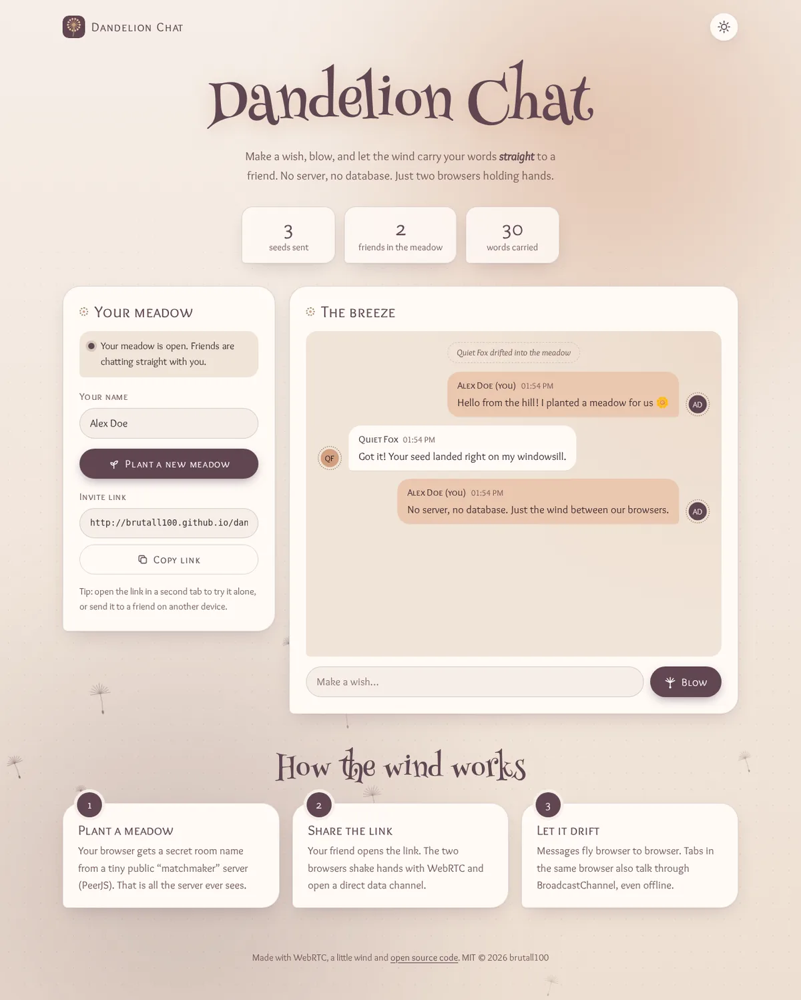
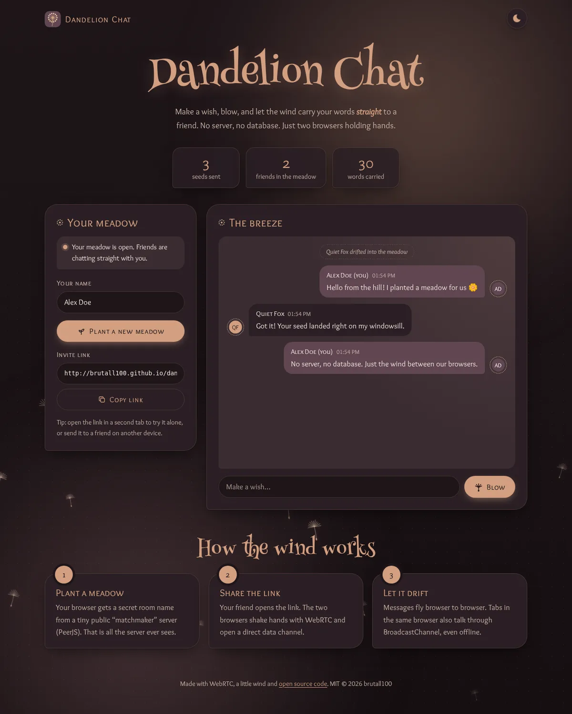
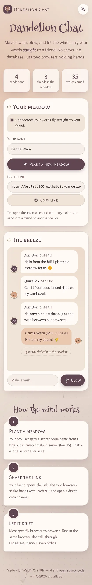

# Dandelion Chat

**A peer-to-peer chat where your words drift straight to a friend, like dandelion seeds on the wind.**

**[▶ Live demo](https://brutall100.github.io/dandelion-chat/)** · **[Source code](https://github.com/brutall100/dandelion-chat)**



<p>
  
  
</p>

---

## About

This project started as my first chat experiment: a form, a Node.js server and a MySQL table.
For version 2 I wanted to learn something new, so I rebuilt it **without any server of my own**:

- You click **Plant a meadow** and get an invite link.
- Your friend opens the link, and the two browsers connect **directly** with **WebRTC**.
- Messages go from browser to browser. There is no database and no chat server in the middle.

A tiny public "matchmaker" (the free PeerJS server) only introduces the two browsers to each other.
It never sees the messages. Because nothing needs a backend, the **real** chat works on GitHub Pages,
not just a demo.

## Features

- 🌬️ **Peer-to-peer chat over WebRTC** (PeerJS). The person who plants a meadow is the host and passes messages on to every guest, so rooms can have more than two people.
- 🗂️ **Tab-to-tab chat with BroadcastChannel**. Tabs of the same browser talk even with no internet, which is handy for trying the app alone.
- 🔁 **No duplicates**: every message has an id, so a message that arrives by both routes is shown only once.
- 💾 **History in your browser** (localStorage, last 60 messages per room). A friend who joins late gets the story so far.
- 🌼 **Dandelion-puff avatars** drawn in SVG from each person's initials. No photos, and random names like *Quiet Fox* until you pick one.
- 🌾 **Living background**: two drifting sunset glows, a soft pollen texture and dandelion seeds that float up with random size, speed, sway and wind. It animates only `transform` and `opacity`, uses half the seeds on phones and pauses in hidden tabs.
- 🌗 **Light and dark themes**: follows your system setting, remembers your choice and never flashes on load. In the dark theme the seeds glow.
- 🔢 **Counters that count up**: seeds sent, friends in the meadow, words carried.
- ✨ **Micro-interactions**: buttons lift and press, a ripple effect, a seed that blows away when you press **Blow**, cards that rise on hover and sections that appear as you scroll.
- ♿ **Accessible**: skip link, visible `:focus-visible`, labelled fields, `aria-live` chat, WCAG-checked contrast and `prefers-reduced-motion` support (no seeds, only a still glow).
- 📱 **Responsive** down to 390 px with no sideways scrolling.
- 🛡️ **Safe rendering**: incoming data is rebuilt field by field, trimmed and shown with `textContent`, so a message can never inject HTML.

## Built with

| Layer | Tech |
|---|---|
| Structure & style | HTML, CSS (custom properties, `color-mix`, grid) |
| Logic | Vanilla JavaScript, Web Animations API, IntersectionObserver |
| Networking | WebRTC via [PeerJS](https://peerjs.com/) 1.5.4 (bundled in `js/vendor/`), BroadcastChannel |
| Hosting | GitHub Pages (static files only) |

### Palette

All colours live as CSS variables at the top of [`css/styles.css`](css/styles.css).

| Token | HEX | Used for |
|---|---|---|
| `--plum` | `#604652` | Light-mode buttons and headings, your bubbles in dark mode |
| `--mauve` | `#735557` | Secondary text in light mode, avatars |
| `--olive` | `#97866A` | Stalks, dotted rings, borders (UI only; darker `#6B5E48` when it must be text) |
| `--peach` | `#D29F80` | Glows, dark-mode buttons and headings, avatars |
| `--bg` | `#F6EEE7` / `#1E1519` | Page background (light / dark) |
| `--text` | `#3A2A31` / `#F3E6DC` | Body text (light / dark) |

Contrast was checked with the WCAG formula. For example, text on the background is 11.8:1 in light mode and 14.6:1 in dark mode, and button text is 8.1:1 in light mode and 7.7:1 in dark mode.
Peach (`#D29F80`) is only 2.3:1 on white, so it is never used for text in light mode.

### Fonts (Google Fonts)

- **Henny Penny**: the storybook title and section headings (display only).
- **Overlock SC**: small-caps headings, labels and buttons.
- **Overlock**: body text and messages (the readable sibling of Overlock SC).

## What I learned

- How **WebRTC** connects two browsers directly, and why it still needs a small signalling server to exchange "phone numbers" first.
- Building a **star-shaped room**: guests talk to the host, and the host relays to everyone.
- Using **BroadcastChannel** for tab-to-tab messaging, and deduplicating messages that arrive by two routes.
- Treating network data as untrusted: validate, trim and render with `textContent`.
- Making a **living background** that is light on the CPU: only `transform` and `opacity`, fewer particles on phones, paused when hidden and turned off for reduced motion.
- A no-flash theme switch: a tiny script in `<head>` sets the theme before the first paint.

## Run it locally

The app is plain static files, so there is nothing to install.

```bash
git clone https://github.com/brutall100/dandelion-chat.git
cd dandelion-chat
npm start                    # serves the folder with `npx serve`
# or: python3 -m http.server 8000
```

Open the address it prints, click **Plant a meadow** and open the invite link in a second tab or on another device.

**Optional: use your own matchmaker server.** By default the app uses the free PeerJS cloud server.
To run your own, start `npx peer --port 9000` and add this line in `index.html` before `js/chat.js`:

```html
<script>window.DANDELION_PEER_OPTIONS = { host: "localhost", port: 9000, path: "/", secure: false };</script>
```

## Project structure

```
dandelion-chat/
├── index.html            # page markup
├── css/
│   └── styles.css        # palette tokens, themes, layout, animations
├── js/
│   ├── theme-init.js     # sets the saved theme before paint (no flash)
│   ├── background.js     # living background: drifting dandelion seeds
│   ├── ui.js             # theme toggle, ripple, scroll reveal, counters, flying seed
│   ├── chat.js           # WebRTC + BroadcastChannel chat, history, avatars
│   └── vendor/
│       └── peerjs.min.js # PeerJS 1.5.4 (MIT)
├── images/
│   └── favicon.svg       # dandelion icon in the palette colours
├── docs/                 # README screenshots (WebP)
├── package.json
└── LICENSE
```

## Credits

- [PeerJS](https://github.com/peers/peerjs) by Michelle Bu, Eric Zhang and contributors, MIT License. Bundled in `js/vendor/`, and its free cloud server is used for matchmaking.
- Fonts [Henny Penny](https://fonts.google.com/specimen/Henny+Penny), [Overlock](https://fonts.google.com/specimen/Overlock) and [Overlock SC](https://fonts.google.com/specimen/Overlock+SC) from Google Fonts, SIL Open Font License.
- "Alex Doe", "Quiet Fox" and the other names in the screenshots are made up.

## License

[MIT](LICENSE) © 2026 brutall100
